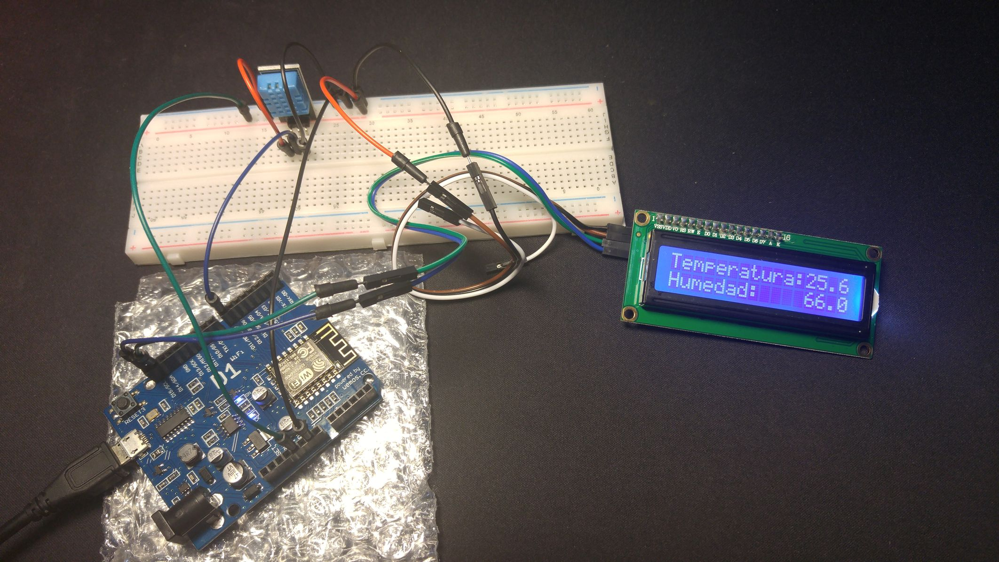
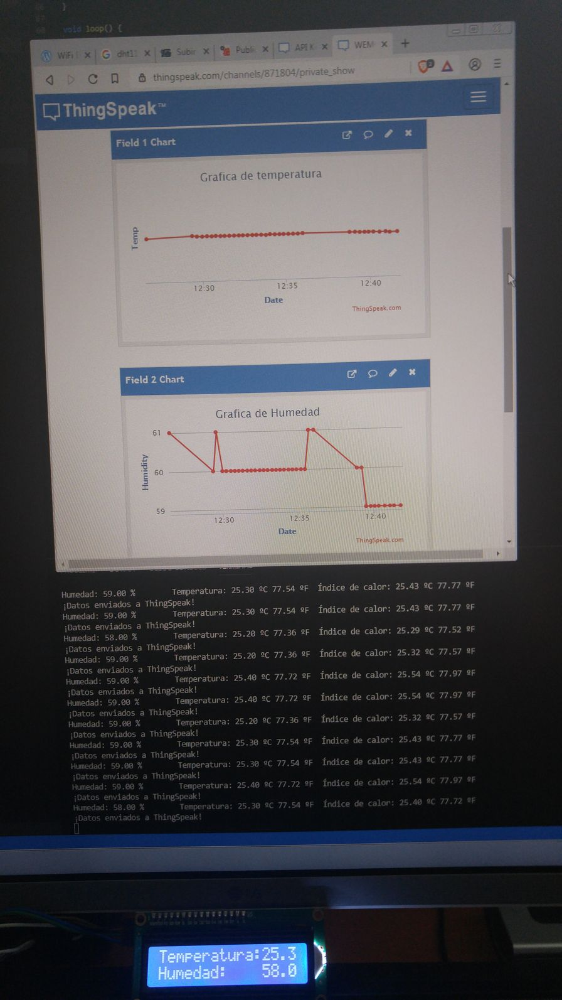
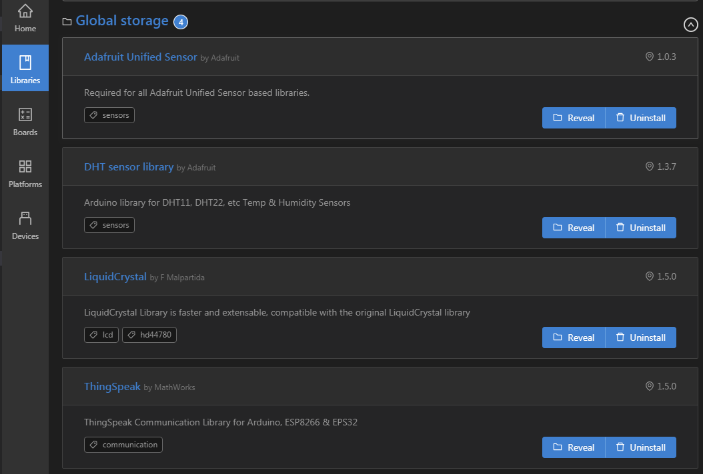
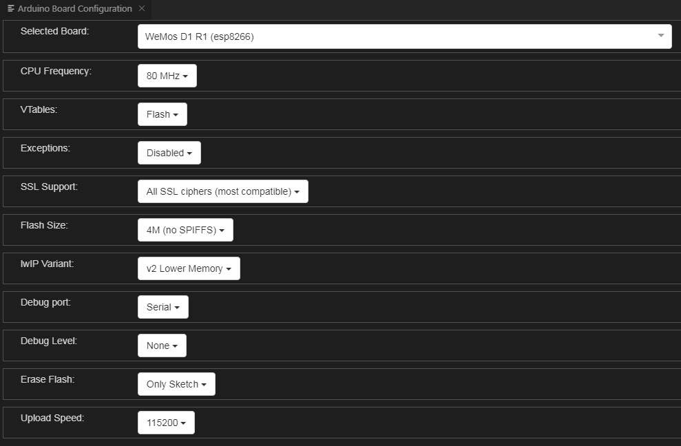
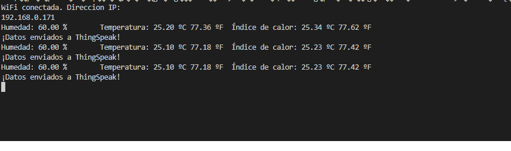
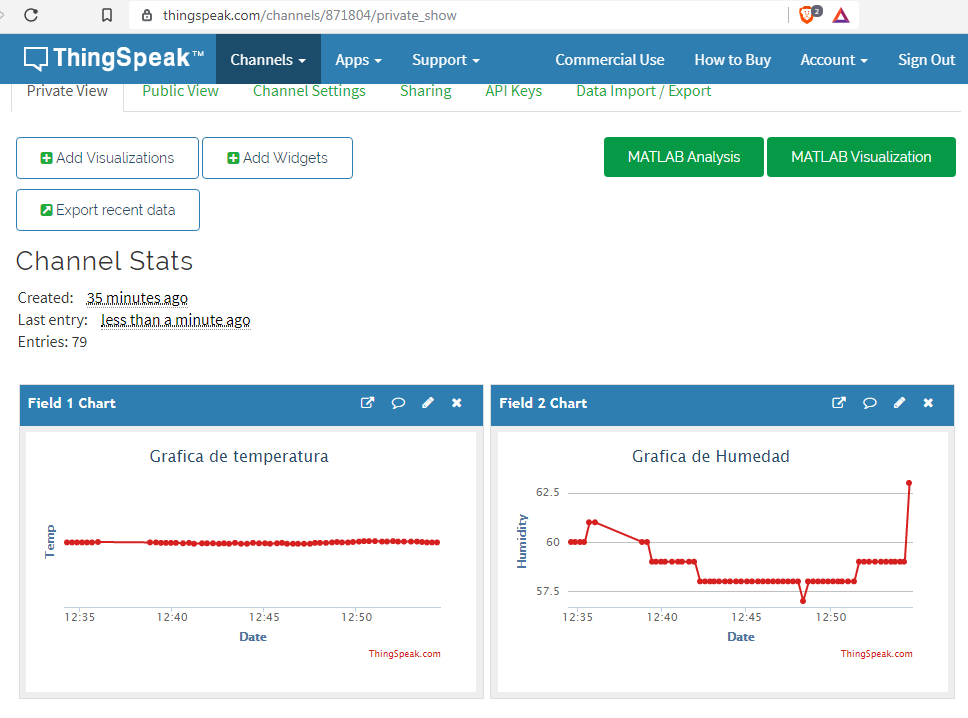

### WEMOS D1 R1 WIFI PROJECT EN VSCODE CON PLATFORMIO Y THINKSPEAK: DHT11 + I2C
Visualización de los datos de temperatura y humedad sobre una pantalla LCD con Wemos D1 R1 
y envio de datos por WIFI a la plataforma thingspeak.com

##### Elementos necesarios:
- Wemos D1 R1 Wifi
- Protoboard
- Sensor DHT11 de temperatura y humedad
- Pantalla LCD con acople I2C
- Cables

##### Software necesario:
- Visual Studio Code
- Plugin PlatformIO IDE para VSCode
  Ref: http://docs.platformio.org/en/latest/ide/pioide.html
- Dar de alta una cuenta en la plataforma https://thingspeak.com/ 

##### Configuración de sensores:
- DHT11 - PIN 7 DIGITAL
- I2C   - PINES D15 (SCL) Y D14 (SDA)

#####  Referencias:
Codigo fuente DTH: https://programarfacil.com/blog/arduino-blog/sensor-dht11-temperatura-humedad-arduino/
Codigo fuente I2C: http://educ8s.tv/arduino-20x4-character-lcd/

Libreria DHT:      https://github.com/adafruit/DHT-sensor-library
Libreria LCD:      https://bitbucket.org/fmalpartida/new-liquidcrystal/downloads

##### Programacion con platformIO en VSCode:

- Configuración librerias:
	

- Configuración placa:
	

- Salida de la ejecución en el monitor serie:
	

##### Visualizacion en ThingSpeaks:

##### Enlaces interesantes de programacion con WEMOS D1:
WiFi ESP8266 Development Board WEMOS D1: 	https://alselectro.wordpress.com/2018/04/14/wifi-esp8266-development-board-wemos-d1/
ESP8266 WEMOS D1 With I2C Serial LCD: 		https://alselectro.wordpress.com/2018/04/16/esp8266-wemos-d1-with-i2c-serial-lcd/
